# 魔力淘App用户手册

**软件名称**：魔力淘App
**版本号**：V1.0.0
**著作权人**：黑龙江省魔淡网络科技有限公司

---

## 目录

1. 软件概述
2. 运行环境
3. 安装说明
4. 功能模块说明
5. 操作流程说明
6. 常见问题

---

## 1. 软件概述

### 1.1 软件简介

魔力淘App是一款闲置物品信息撮合平台移动应用，为用户提供便捷的闲置物品信息浏览、发布、在线沟通等功能。用户可以通过本应用发布闲置物品信息、浏览他人发布的物品、通过平台内置即时通讯工具与对方在线协商，**交易由用户自行线下完成，平台不提供交易担保**。

**开发背景**：
随着社会经济发展和消费升级，闲置物品流通需求日益增长。传统闲置物品交易方式存在信息不对称、沟通效率低、信任成本高等问题。魔力淘App通过移动互联网技术，搭建信息撮合平台，帮助用户高效发现闲置资源、便捷在线沟通，促进资源循环利用。

**平台定位**：
- 信息撮合平台：提供物品信息发布与展示服务
- 在线沟通工具：内置即时通讯，支持买卖双方在线协商
- 资源流通桥梁：连接闲置物品供需双方，促进资源合理配置
- 非交易平台：不参与交易环节，不提供交易担保，不承担交易风险

### 1.2 主要功能

| 功能类别 | 功能项 | 说明 |
|----------|--------|------|
| 信息浏览 | 帖子浏览与搜索 | 分类筛选、关键词搜索、热门推荐 |
| 信息发布 | 闲置物品信息发布与管理 | 发布、编辑、删除、置顶 |
| 即时通讯 | 私聊、群聊、消息推送 | 文字、图片、表情消息 |
| 社交关系 | 好友关系管理 | 添加好友、好友申请、通讯录 |
| 资产管理 | 魔力值保证金充值与退还 | PC端充值、联系管理员退还 |
| 个人中心 | 个人信息管理 | 头像、昵称、联系方式 |
| 系统功能 | 公告查看、设置 | 系统公告、应用配置 |
| 特色功能 | 秒杀人气活动 | 限时特惠、实时聊天 |

### 1.3 适用对象

**目标用户群体**：
- 有闲置物品需要处理的个人用户
- 寻找特定物品的求购用户
- 希望通过在线沟通协商交易的用户
- 关注二手物品市场的用户

**使用场景**：
| 场景 | 用户行为 | 平台支持 |
|------|----------|----------|
| 闲置处理 | 发布闲置物品信息 | 帖子发布、图片上传、分类标签 |
| 物品求购 | 浏览搜索感兴趣物品 | 分类筛选、关键词搜索、详情查看 |
| 在线协商 | 与对方沟通交易细节 | 私聊、群聊、消息推送 |
| 资产管理 | 充值提现操作 | 魔力值查询、PC端充值、联系管理员退还 |

### 1.4 平台性质声明

本平台仅为用户提供信息发布与在线沟通撮合服务，物品交易由用户自行线下完成。

**平台服务范围**：
- ✅ 提供信息发布与展示平台
- ✅ 提供在线即时通讯工具
- ✅ 提供用户关系管理功能
- ✅ 提供魔力值保证金服务（PC端充值）

**平台不承担责任**：
- ❌ 不参与交易环节
- ❌ 不提供交易担保
- ❌ 不承担交易纠纷责任
- ❌ 不保证物品信息真实性

### 1.5 技术架构

| 层级 | 技术栈 | 说明 |
|------|--------|------|
| 前端 | Flutter 3.x + Dart 3.x | 跨平台移动应用框架，支持Android/iOS |
| 状态管理 | flutter_riverpod | 响应式状态管理 |
| 路由 | go_router | 声明式路由管理 |
| 网络 | dio | HTTP客户端，支持拦截器 |
| 后端 | C# .NET 8 + ABP Framework | 微服务架构，模块化设计 |
| 数据库 | MySQL | 关系型数据库存储 |
| 缓存 | Redis | 高性能缓存服务 |
| 即时通讯 | WebSocket | 实时双向通信 |
| 支付 | 微信支付 | 移动应用支付SDK |

---

## 2. 运行环境

### 2.1 Android系统要求

| 项目 | 要求 |
|------|------|
| 操作系统 | Android 8.0 及以上版本 |
| 存储空间 | 至少100MB可用空间 |
| 内存 | 建议3GB及以上 |
| 网络 | 需要网络连接（Wi-Fi或移动数据） |
| 权限 | 网络权限、存储权限、相机权限（拍照上传） |

**推荐设备**：
- 主流Android手机（华为、小米、OPPO、vivo等）
- Android 10.0及以上版本获得最佳体验

### 2.2 iOS系统要求

| 项目 | 要求 |
|------|------|
| 操作系统 | iOS 12.0 及以上版本 |
| 存储空间 | 至少100MB可用空间 |
| 内存 | 建议2GB及以上 |
| 网络 | 需要网络连接（Wi-Fi或移动数据） |

**推荐设备**：
- iPhone 8及以上机型
- iOS 15.0及以上版本获得最佳体验

### 2.3 网络要求

| 场景 | 网络要求 |
|------|----------|
| 信息浏览 | 2G/3G/4G/5G/Wi-Fi均可 |
| 即时通讯 | 建议3G及以上网络 |
| 图片上传 | 建议4G/5G/Wi-Fi网络 |
| 支付操作 | 必须稳定网络（建议Wi-Fi或4G+） |

---

## 3. 安装说明

### 3.1 Android安装

**安装步骤**：
1. 从应用市场搜索"魔力淘"下载安装包
2. 点击安装包进行安装
3. 如提示"未知来源"，需在设置中允许安装未知来源应用
4. 安装完成后点击图标启动应用
5. 首次启动需要授予以下权限：
   - 网络权限（必需）：用于数据通信
   - 存储权限（可选）：用于图片上传
   - 相机权限（可选）：用于拍照上传

**注意事项**：
- 安装包大小约50MB
- 安装后首次启动会下载必要资源
- 建议在Wi-Fi环境下安装

### 3.2 iOS安装

**安装步骤**：
1. 打开App Store应用
2. 在搜索栏输入"魔力淘"
3. 点击搜索结果中的"魔力淘"应用
4. 点击"获取"按钮下载安装
5. 使用Face ID或Touch ID确认下载
6. 安装完成后点击图标启动应用

**注意事项**：
- 需要Apple ID登录App Store
- 应用大小约80MB
- 建议在Wi-Fi环境下下载

### 3.3 首次启动

**启动流程**：
1. 点击应用图标启动
2. 显示启动画面（约2秒）
3. 检查版本更新（如有新版本弹出提示）
4. 进入登录页面

**权限说明**：
| 权限 | 用途 | 是否必需 |
|------|------|----------|
| 网络权限 | 数据通信、消息推送 | 必需 |
| 存储权限 | 图片上传、缓存存储 | 可选 |
| 相机权限 | 拍照上传头像/商品图 | 可选 |
| 通知权限 | 消息推送通知 | 可选 |

---

## 4. 功能模块说明

### 4.1 首页模块

**功能描述**：首页是用户进入应用后的第一个界面，展示平台品牌形象、功能入口、文章轮播、广告位等内容。

#### 4.1.1 界面元素详解

| 元素 | 说明 |
|------|------|
| 顶部导航栏 | 显示"魔力淘"标题，主题色背景 |
| 品牌展示区 | 平台品牌 Logo 和形象展示 |
| 交易站入口 | 点击跳转帖子列表，浏览闲置物品 |
| 秒杀场入口 | 点击跳转秒杀聊天室，参与特惠活动 |
| 文章轮播区 | 平台资讯、活动文章轮播展示，自动切换 |
| 广告位网格 | 推广内容网格展示 |

#### 4.1.2 功能入口

| 入口名称 | 图片 | 功能说明 |
|----------|------|----------|
| 交易站 | 交易站图片 | 跳转帖子列表，浏览闲置物品 |
| 秒杀场 | 秒杀场图片 | 跳转秒杀聊天页，参与特惠活动 |

#### 4.1.3 文章轮播

**展示规则**：
- 自动轮播间隔：5秒
- 支持手动左右滑动
- 显示当前页码指示器（线条样式）
- 点击文章图片查看详情（预留功能）

**操作方式**：
- 左右滑动切换文章
- 页面底部点指示器显示当前位置

#### 4.1.4 版本更新

**更新检测**：
- 每次启动自动检测版本
- 有新版本时弹出更新提示对话框
- 显示版本号和更新内容说明

**更新方式**：
- 点击"立即更新"跳转下载页面
- 支持强制更新和可选更新

---

### 4.2 认证登录模块

**功能描述**：认证登录模块提供多种登录方式，确保用户账号安全和便捷登录。

#### 4.2.1 登录方式

| 登录方式 | 说明 | 适用场景 |
|----------|------|----------|
| 账号密码登录 | 输入用户名和密码登录 | 常规登录方式 |
| 短信验证码登录 | 输入手机号和验证码登录 | 快速便捷登录 |
| 微信一键登录 | 微信授权后自动登录 | 快速便捷登录 |

#### 4.2.2 界面元素详解

| 元素 | 说明 |
|------|------|
| Logo区域 | 平台品牌标识展示 |
| 用户名输入框 | 输入注册用户名（支持手机号/邮箱） |
| 密码输入框 | 输入登录密码（支持显示/隐藏切换） |
| 登录按钮 | 点击进行账号密码登录 |
| 微信登录按钮 | 点击跳转微信授权登录 |
| 记住账号选项 | 勾选后下次自动填充用户名 |

#### 4.2.3 账号密码登录

**操作步骤**：
1. 在用户名输入框输入账号
2. 在密码输入框输入密码
3. 可勾选"记住账号"方便下次登录
4. 点击"登录"按钮
5. 验证成功后自动跳转首页

**密码输入说明**：
- 默认密码显示为"******"
- 点击眼睛图标可切换明文/密文显示
- 密码错误时提示"账号或密码错误"

#### 4.2.4 微信一键登录

**操作步骤**：
1. 点击微信登录图标按钮
2. 系统自动唤起微信应用
3. 在微信中确认授权登录
4. 授权成功后自动返回应用
5. 自动完成登录并跳转首页

**前置条件**：
- 手机已安装微信应用
- 微信账号已实名认证
- 首次使用需绑定魔力淘账号

**异常处理**：
| 情况 | 处理方式 |
|------|----------|
| 未安装微信 | 提示安装微信应用 |
| 微信授权失败 | 提示重新尝试或使用账号登录 |
| 账号未绑定 | 提示先使用账号登录后绑定微信 |

#### 4.2.5 短信验证码登录

**操作步骤**：
1. 点击"短信验证"登录方式切换
2. 输入手机号码
3. 点击"获取验证码"按钮
4. 输入收到的6位短信验证码
5. 点击"登录"按钮完成登录

**前置条件**：
- 手机号已注册并绑定账号
- 手机可正常接收短信

**异常处理**：
| 情况 | 处理方式 |
|------|----------|
| 手机号格式错误 | 提示"请输入正确的手机号" |
| 验证码发送失败 | 提示"发送验证码失败"，可重试 |
| 验证码错误 | 提示"请输入6位验证码" |
| 验证码过期 | 需要重新获取 |

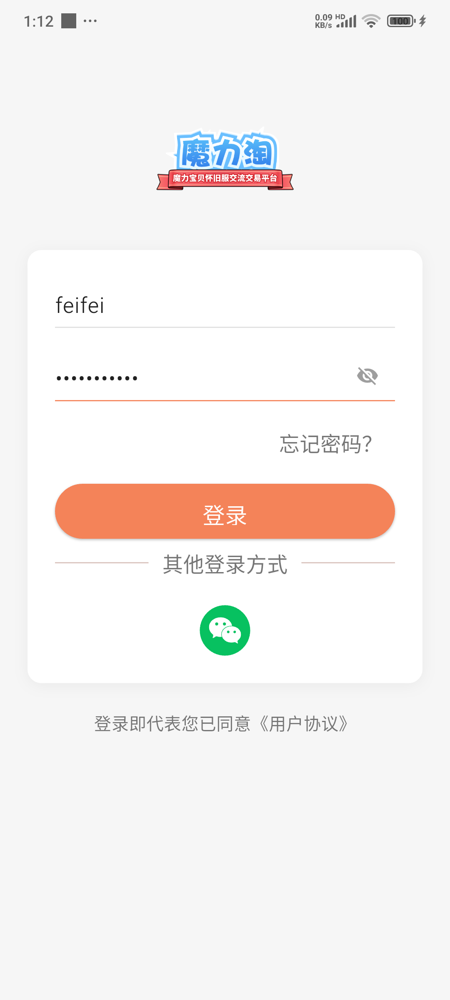

#### 4.2.6 注意事项

1. 连续输错密码5次，账号将被锁定30分钟
2. 微信登录需要微信应用版本支持
3. 建议绑定微信以便快速登录
4. 退出登录后需重新登录

---

### 4.3 撮合帖子模块

**功能描述**：撮合帖子模块是核心业务模块，用户可发布、浏览、管理闲置物品信息帖，实现供需双方的信息撮合。

#### 4.3.1 交易站（帖子列表）

**功能描述**：交易站展示平台所有撮合帖子信息，用户可按分类浏览、搜索感兴趣的内容。

**界面元素详解**：

| 元素 | 说明 |
|------|------|
| 搜索栏 | 输入关键词搜索帖子 |
| 热搜词 | 热门搜索词快速搜索 |
| 分类标签 | 帖子分类筛选（交易/求购/问答/分享/其他） |
| 置顶区域 | 平台推荐的置顶帖子 |
| 帖子卡片 | 帖子标题、图片、作者、时间、浏览量 |
| 发布按钮 | 悬浮按钮，点击发布新帖子 |
| 下拉刷新 | 下拉刷新获取最新帖子 |
| 上拉加载 | 上拉加载更多历史帖子 |

**分类标签说明**：

| 分类 | 说明 |
|------|------|
| 全部 | 显示所有类型帖子 |
| 交易 | 出售闲置物品信息 |
| 求购 | 寻找特定物品需求 |
| 问答 | 咨询类帖子 |
| 分享 | 经验分享类帖子 |
| 其他 | 其他类型帖子 |

**帖子卡片信息**：
- 帖子缩略图（最多显示3张）
- 帖子标题（最多显示2行）
- 作者头像和昵称
- 发布时间（几分钟前/几小时前/具体日期）
- 浏览量统计

**操作说明**：
1. **浏览帖子**：上下滑动查看帖子列表
2. **分类筛选**：点击分类标签筛选帖子类型
3. **关键词搜索**：在搜索框输入关键词搜索
4. **热搜搜索**：点击热搜词快速搜索热门内容
5. **下拉刷新**：下拉刷新获取最新帖子
6. **上拉加载**：上拉加载更多历史帖子
7. **查看详情**：点击帖子卡片进入详情页
8. **发布帖子**：点击右下角悬浮按钮发布新帖

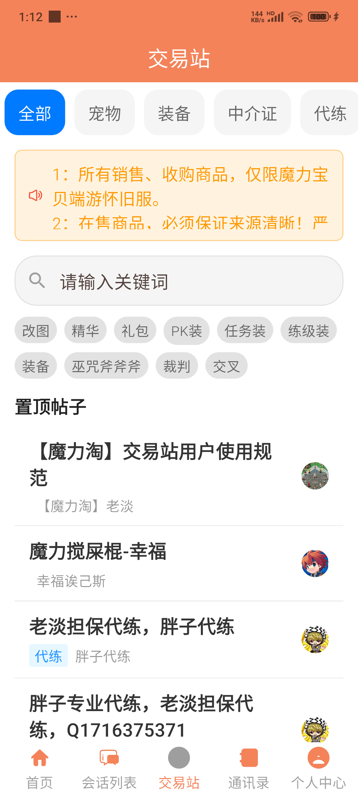

#### 4.3.2 帖子详情页

**功能描述**：帖子详情页展示物品信息的完整内容，用户可查看详情并通过内置通讯工具联系发布者进行在线协商。

**界面元素详解**：

| 元素 | 说明 |
|------|------|
| 返回按钮 | 返回帖子列表页 |
| 帖子标题 | 帖子完整标题 |
| 作者信息 | 作者头像、昵称、发布时间 |
| 分类标签 | 帖子所属分类 |
| 内容区域 | 富文本内容展示 |
| 图片展示 | 帖子图片，支持点击放大 |
| 联系方式 | 作者微信/QQ（如有填写） |
| 联系对方按钮 | 跳转私聊进行在线协商 |
| 编辑按钮 | 编辑帖子内容（仅作者可见） |
| 删除按钮 | 删除帖子（仅作者可见） |

**图片预览功能**：
- 点击图片进入全屏预览
- 支持左右滑动切换图片
- 双指缩放查看细节
- 点击关闭按钮退出预览

**操作说明**：
1. 查看帖子完整内容和图片
2. 点击图片放大预览，双指缩放查看细节
3. 点击"联系对方"跳转私聊进行在线协商
4. 作者可点击编辑修改帖子内容
5. 作者可点击删除移除帖子
6. **交易由双方自行线下完成，平台不参与**

**注意事项**：
- 联系方式由发布者自愿填写，可能不完整
- 私聊消息实时发送，请礼貌沟通
- 帖子删除后不可恢复，请谨慎操作

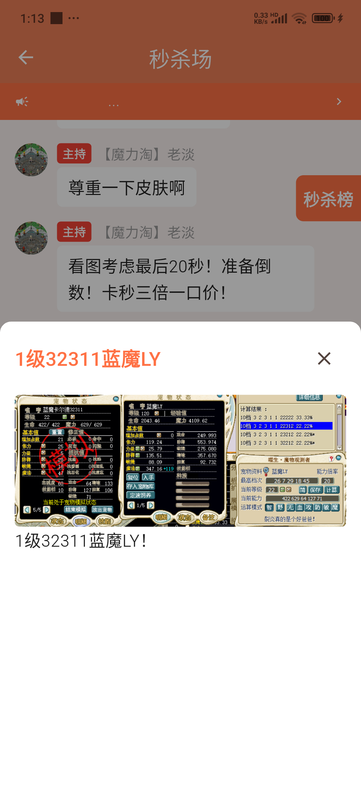

#### 4.3.3 发布帖子页

**功能描述**：用户可通过发布帖子功能，将闲置物品信息发布到平台，等待有意向的用户联系。

**界面元素详解**：

| 元素 | 说明 |
|------|------|
| 返回按钮 | 放弃发布返回上一页 |
| 标题输入框 | 输入帖子标题（必填，最多100字） |
| 分类选择器 | 选择帖子分类（交易/求购/问答/分享/其他） |
| 内容输入框 | 输入帖子正文内容 |
| 图片上传区 | 上传物品图片（最多9张） |
| 联系方式输入 | 填写微信/QQ（可选） |
| 发布按钮 | 提交帖子到平台 |

**图片上传说明**：
- 支持拍照上传
- 支持相册选择
- 单张图片最大10MB
- 图片自动压缩优化

**操作说明**：
1. 输入帖子标题（必填，最多100字）
2. 选择帖子分类（必选）
3. 输入帖子正文内容
4. 上传物品图片（支持多张，最多9张）
5. 填写联系方式（可选，微信/QQ）
6. 点击发布提交帖子

**发布后处理**：
- 发布成功后自动跳转帖子详情页
- 帖子进入审核队列（如有审核机制）
- 审核通过后在列表展示

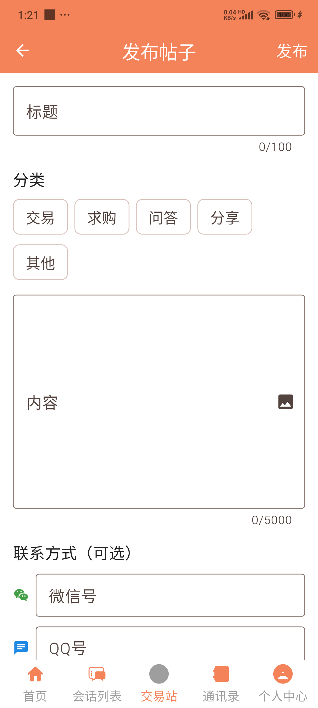

---

### 4.4 即时通讯模块

**功能描述**：即时通讯模块提供实时聊天功能，支持私聊、群聊、秒杀场等场景，是用户在线协商的核心工具。

#### 4.4.1 会话列表

**功能描述**：会话列表展示所有聊天会话，包括私聊、群聊、系统频道等。

**界面元素详解**：

| 元素 | 说明 |
|------|------|
| 搜索栏 | 搜索会话名称 |
| 会话列表 | 所有聊天会话 |
| 系统频道 | 系统公告、新手群等特殊频道 |
| 会话头像 | 对方头像或群组头像 |
| 会话名称 | 对方昵称或群组名称 |
| 最新消息 | 最新一条消息预览 |
| 时间显示 | 最新消息时间 |
| 未读红点 | 未读消息数量提示 |
| 消息类型图标 | 文字/图片/系统消息图标 |

**会话排序规则**：
- 按最新消息时间倒序排列
- 置顶会话优先显示
- 未读会话优先显示

**操作说明**：
1. 点击会话进入聊天界面
2. 查看未读消息红点数量
3. 长按会话可删除聊天记录
4. 点击系统频道进入群聊
5. 下拉刷新会话列表

**特殊频道说明**：

| 频道 | 说明 |
|------|------|
| 系统公告 | 接收平台公告通知 |
| 新手群 | 新用户引导群聊 |
| 秒杀场 | 秒杀活动聊天室 |

#### 4.4.2 私聊界面

**功能描述**：私聊界面支持一对一实时聊天，是用户在线协商的主要工具。

**界面元素详解**：

| 元素 | 说明 |
|------|------|
| 顶部导航栏 | 对方头像、昵称、返回按钮 |
| 消息列表 | 聊天消息气泡列表 |
| 消息气泡 | 文字/图片/表情消息 |
| 输入框 | 消息输入区域 |
| 表情按钮 | 打开表情选择器 |
| 图片按钮 | 选择图片发送 |
| 发送按钮 | 发送消息 |

**消息类型**：

| 类型 | 说明 |
|------|------|
| 文字消息 | 纯文字内容 |
| 图片消息 | 图片内容，支持点击放大 |
| 表情消息 | 表情符号 |
| 系统消息 | 系统通知（如对方上线） |

**消息气泡样式**：
- 自己发送：右侧蓝色气泡
- 对方发送：左侧灰色气泡
- 时间戳：每隔一段时间显示

**操作说明**：
1. 在输入框输入文字消息
2. 点击发送按钮发送消息
3. 点击图片按钮选择图片发送
4. 点击表情按钮选择表情发送
5. 上拉加载历史消息
6. 点击对方头像查看资料
7. 点击图片消息放大查看

**消息状态**：
- 发送中：显示加载动画
- 发送成功：无特殊标识
- 发送失败：显示红色感叹号，可点击重发

#### 4.4.3 群聊界面

**功能描述**：群聊界面支持多人同时在线交流，适用于秒杀场、兴趣群组等场景。

**界面元素详解**：

| 元素 | 说明 |
|------|------|
| 顶部导航栏 | 群名称、成员数量、返回按钮 |
| 成员头像区 | 在线成员头像展示 |
| 消息列表 | 群聊消息滚动列表 |
| 输入框 | 消息输入区域 |
| 表情按钮 | 打开表情选择器 |
| 图片按钮 | 选择图片发送 |
| 发送按钮 | 发送消息 |

**群聊特性**：
- 实时消息同步
- 在线成员展示
- 消息滚动更新
- 历史消息加载

**操作说明**：
1. 进入群聊查看历史消息
2. 发送文字、图片、表情消息
3. 查看在线成员列表
4. 点击成员头像查看资料
5. 上拉加载更多历史消息

#### 4.4.4 秒杀场

**功能描述**：秒杀场是平台的限时特惠活动聊天室，用户可以参与商品的超值优惠活动，通过实时聊天与其他用户和管理员交流。秒杀场集成在即时通讯模块中，以聊天室形式呈现。

**界面元素详解**：

| 元素 | 说明 |
|------|------|
| 顶部导航栏 | 显示"秒杀场"标题和频道名称 |
| 公告区域 | 显示当前秒杀活动公告和规则 |
| 消息列表 | 展示聊天室消息，包括出价信息、系统公告等 |
| 输入区域 | 输入文字、图片、表情消息发送 |
| 秒杀榜按钮 | 点击展开秒杀商品列表 |

**秒杀场特点**：
- 实时消息同步，所有用户可见
- 支持文字、图片、表情消息发送
- 显示在线成员数量
- 有公告弹窗显示活动规则

**操作说明**：
1. 进入秒杀场聊天室
2. 查看当前秒杀活动和公告
3. 在聊天室中发送消息交流
4. 点击秒杀榜按钮查看秒杀商品列表
5. 参与出价或竞拍（功能预留）

**注意事项**：
- 秒杀场为聊天室形式，支持多人同时在线
- 活动规则以聊天公告为准
- 秒杀成功需完成支付（功能预留）

---

### 4.5 通讯录模块

**功能描述**：通讯录模块管理好友关系，支持添加好友、处理好友申请、快速发起聊天等操作。

**界面元素详解**：

| 元素 | 说明 |
|------|------|
| 搜索框 | 输入昵称搜索好友 |
| 好友申请区 | 待处理的好友申请列表 |
| 好友列表 | 已添加的好友列表 |
| 好友头像 | 好友头像展示 |
| 好友昵称 | 好友昵称显示 |
| 在线状态 | 在线/离线状态标识 |
| 操作按钮 | 同意/拒绝/发起聊天 |

**好友申请处理**：

| 操作 | 说明 |
|------|------|
| 同意申请 | 点击同意，添加为好友 |
| 拒绝申请 | 点击拒绝，忽略申请 |
| 忽略申请 | 不处理，保留在申请列表 |

**操作说明**：
1. 在搜索框输入昵称查找好友
2. 查看好友申请列表
3. 点击同意或拒绝处理好友申请
4. 点击好友进入私聊界面
5. 长按好友可删除好友关系

**好友状态说明**：
- 在线：显示绿色圆点
- 离线：显示灰色圆点
- 忙碌：显示红色圆点

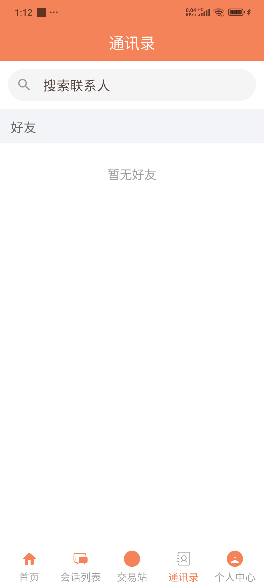

---

### 4.6 个人中心模块

**功能描述**：个人中心模块管理用户个人信息、资产、订单等核心数据，是用户的个人管理中心。

#### 4.6.1 个人中心主页

**界面元素详解**：

| 区域 | 元素 | 说明 |
|------|------|------|
| 用户信息区 | 头像 | 用户头像，点击可修改 |
| | 昵称 | 用户昵称 |
| | 编号 | 用户唯一编号 |
| | 好友数 | 好友数量统计 |
| | 余额 | 账户余额显示 |
| | 设置按钮 | 右上角设置入口 |
| 工作台 | 充值入口 | 点击跳转充值页面 |
| | 提现入口 | 点击跳转提现页面 |
| | 余额明细 | 查看余额收支明细 |
| | 保证金记录 | 查看保证金记录 |
| 买家功能区 | 出价中/待收货 | 买家订单入口 |
| | 已成交 | 已完成订单入口 |
| 卖家功能区 | 我发布的 | 已发布帖子列表 |
| | 待发货 | 待发货订单入口 |
| | 保证金记录 | 缴纳保证金记录 |
| 系统功能区 | 功能列表 | 其他功能入口 |
| 底部信息 | 版本号 | 当前APP版本 |

**操作说明**：
1. 点击头像进入个人信息编辑页
2. 查看好友数量和账户余额
3. 进入工作台管理资产（充值、提现、余额明细）
4. 点击买家功能区查看订单
5. 点击卖家功能区管理发布内容
6. 点击右上角设置进入设置页面

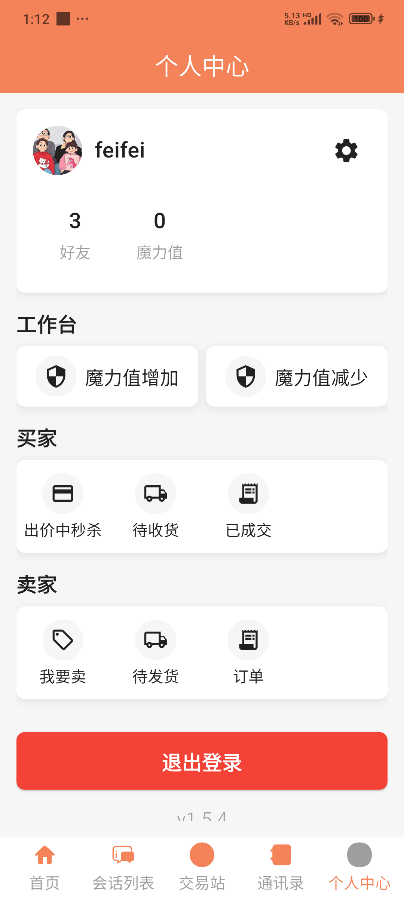

#### 4.6.2 个人信息编辑

**功能描述**：个人信息编辑页面允许用户修改个人资料。

**界面元素详解**：

| 元素 | 说明 |
|------|------|
| 用户编号 | 系统分配的唯一编号，不可修改 |
| 头像区域 | 显示当前头像，点击更换 |
| 昵称输入框 | 输入昵称（最多20字） |
| QQ号输入框 | 输入QQ号（可选） |
| 微信号输入框 | 输入微信号（可选） |
| 保存按钮 | 提交修改保存 |

**头像更换方式**：
- 拍照：打开相机拍照上传
- 相册：从相册选择图片上传
- 图片自动裁剪为正方形

**操作说明**：
1. 点击头像选择拍照或相册更换
2. 修改昵称（最多20字）
3. 填写或修改QQ号（可选）
4. 填写或修改微信号（可选）
5. 点击保存按钮提交修改

**注意事项**：
- 昵称不能包含敏感词
- QQ号和微信号仅供展示，请谨慎填写
- 修改后需要点击保存才会生效

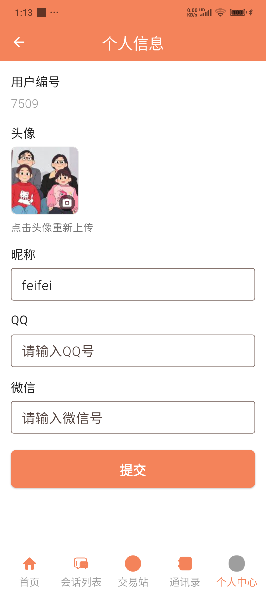

#### 4.6.3 工作台（资产中心）

**功能描述**：工作台提供账户资产管理功能，包括魔力值（保证金）充值、提现等功能。

**界面元素详解**：

| 元素 | 说明 |
|------|------|
| 魔力值展示 | 当前账户魔力值（保证金）余额 |
| 魔力值增加 | 充值魔力值（保证金） |
| 魔力值减少 | 申请退还魔力值 |

**充值流程**：
1. 点击"魔力值增加"按钮
2. 查看固定保证金金额（¥51）
3. 根据引导前往 PC 端（www.molitao.top）完成充值
4. 充值成功后魔力值自动更新

**提现流程**：
1. 点击"魔力值减少"按钮
2. 查看提现说明（功能正在配置中）
3. 联系管理员处理退还事宜
4. 管理员审核后完成退款

**操作说明**：
1. 查看当前魔力值余额
2. 点击"魔力值增加"前往 PC 端充值
3. 点击"魔力值减少"申请退还

**注意事项**：
- 魔力值保证金固定金额为 ¥51
- 充值需前往 PC 端（www.molitao.top）完成支付
- 提现功能正在配置中，需联系管理员处理
- 退款联系管理员老淡：QQ 383875411，微信 18845639111

#### 4.6.4 已成交记录

**功能描述**：已成交记录展示用户历史成交的物品信息，方便用户查看交易记录。

**界面元素详解**：

| 元素 | 说明 |
|------|------|
| 记录列表 | 成交记录列表展示 |
| 物品图片 | 成交物品缩略图 |
| 物品名称 | 成交物品名称 |
| 成交价格 | 成交时的价格 |
| 成交时间 | 交易完成时间 |

**操作说明**：
1. 浏览已成交物品列表
2. 点击记录查看详情
3. 查看成交时间和价格信息
4. 下拉刷新获取最新记录

**注意事项**：
- 仅显示已完成的成交记录
- 记录按时间倒序排列
- 可通过时间筛选查看历史记录

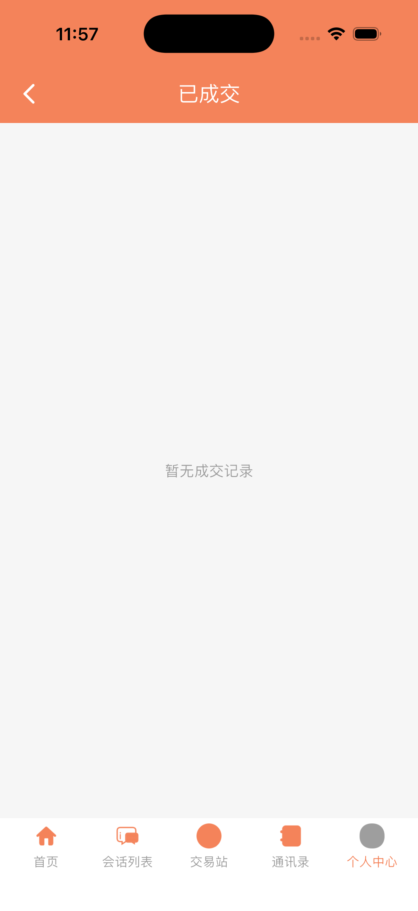

---

### 4.7 公告模块

**功能描述**：公告模块展示平台公告和通知，包括系统公告、活动通知、规则说明等。

**界面元素详解**：

| 元素 | 说明 |
|------|------|
| 公告列表 | 所有公告列表展示 |
| 分类筛选 | 系统公告、活动通知等分类 |
| 公告图片 | 公告封面图片预览 |
| 标题展示 | 公告标题 |
| 发布时间 | 公告发布日期 |
| 阅读状态 | 已读/未读标识 |

**公告类型**：

| 类型 | 说明 |
|------|------|
| 系统公告 | 系统更新、维护通知等 |
| 活动通知 | 平台活动、优惠信息等 |
| 规则说明 | 平台规则、使用指南等 |
| 其他公告 | 其他重要信息 |

**操作说明**：
1. 浏览公告列表
2. 点击分类标签筛选公告类型
3. 点击公告卡片查看详情
4. 下拉刷新获取最新公告
5. 查看已读/未读状态

**注意事项**：
- 重要公告会推送通知提醒
- 未读公告显示红点标识
- 公告内容以后台发布为准

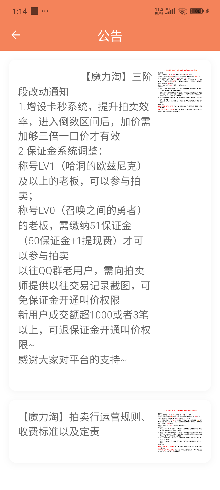

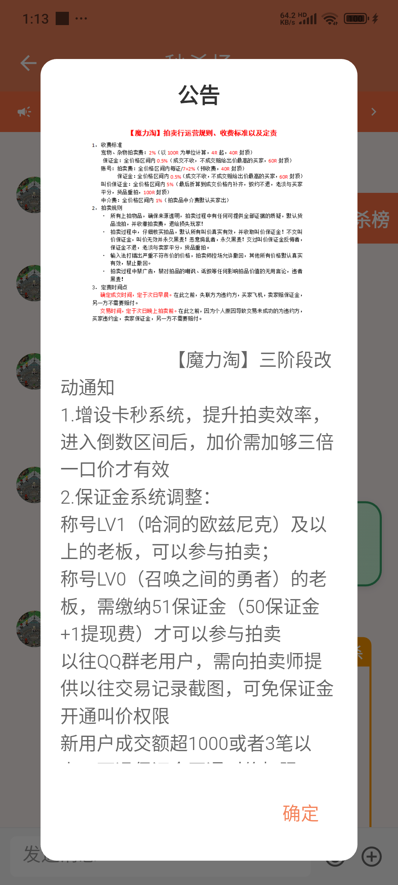

---

### 4.8 设置模块

**功能描述**：设置模块提供应用基础配置功能，包括推送通知、清除缓存、版本信息、账号安全、关于等。

**界面元素详解**：

| 元素 | 说明 |
|------|------|
| 个人信息入口 | 跳转个人信息编辑页面 |
| 账号安全入口 | 跳转账号安全设置页面 |
| 修改密码入口 | 修改登录密码（弹窗形式） |
| 推送通知开关 | 开启/关闭消息推送 |
| 清除缓存按钮 | 清理应用缓存数据，显示当前缓存大小 |
| 关于入口 | 跳转关于页面 |
| 用户协议链接 | 查看用户协议 |
| 隐私政策链接 | 查看隐私政策 |
| 退出登录按钮 | 安全退出当前账号 |

**账户管理说明**：
- 点击"个人信息"可编辑头像、昵称、联系方式
- 点击"账号安全"可管理微信绑定、手机号绑定等
- 点击"修改密码"弹出对话框修改登录密码

**推送通知说明**：
- 开启后接收消息推送通知
- 关闭后仅在使用时接收消息
- 系统消息不受开关影响
- 会检测系统通知权限状态

**清除缓存说明**：
- 清除图片缓存、数据缓存
- 不影响账号信息和登录状态
- 清除后首次加载可能较慢

**操作说明**：
1. 点击个人信息编辑个人资料
2. 点击账号安全进入安全设置
3. 点击修改密码更换登录密码
4. 开启/关闭推送通知开关
5. 点击清除缓存释放存储空间
6. 点击关于查看版本信息
7. 点击用户协议/隐私政策阅读相关规定
8. 点击退出登录安全退出账号

**注意事项**：
- 清除缓存不会删除聊天记录
- 退出登录需重新登录使用
- 建议定期清除缓存释放空间

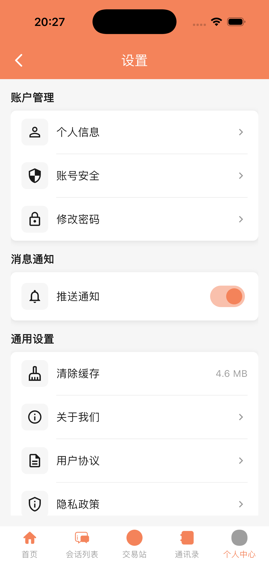

---

### 4.9 账号安全模块

**功能描述**：账号安全模块提供账号安全相关设置，包括修改密码、绑定微信、绑定手机号等安全功能。

**界面元素详解**：

| 元素 | 说明 |
|------|------|
| 当前登录方式 | 显示已绑定的登录方式 |
| 修改密码入口 | 设置或修改登录密码 |
| 绑定微信入口 | 绑定微信账号快捷登录 |
| 绑定手机号入口 | 绑定或更换手机号 |
| 账号安全提示 | 安全建议和提醒 |

**修改密码流程**：
1. 点击修改密码入口
2. 输入当前密码验证身份
3. 输入新密码
4. 确认新密码
5. 提交修改完成

**密码要求**：
- 长度6-20位
- 建议包含字母和数字
- 不能与旧密码相同

**绑定微信流程**：
1. 点击绑定微信入口
2. 系统唤起微信应用
3. 在微信中确认授权
4. 授权成功返回应用
5. 绑定完成显示已绑定

**绑定手机号流程**：
1. 点击绑定手机号入口
2. 输入手机号码
3. 获取并输入验证码
4. 验证成功完成绑定

**操作说明**：
1. 查看当前绑定的登录方式
2. 点击修改密码，设置新密码
3. 点击绑定微信，授权绑定微信账号
4. 点击绑定手机号，绑定或更换手机号
5. 根据提示完成安全验证

**注意事项**：
- 建议绑定多种登录方式
- 定期修改密码提高安全性
- 绑定微信后可快速登录
- 手机号可用于找回密码

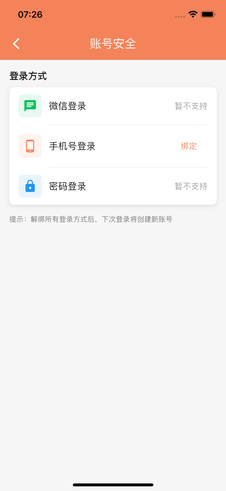

---

### 4.10 关于模块

**功能描述**：关于模块展示应用版本信息、检查更新、评分反馈等功能。

**界面元素详解**：

| 元素 | 说明 |
|------|------|
| 应用图标 | 平台应用图标展示 |
| 应用名称 | "魔力淘"名称展示 |
| 版本号 | 当前版本（格式：v1.0.0 (buildNumber)） |
| 检查更新 | 检测新版本可用性 |
| 给我们评分 | 支持应用评分 |
| 意见反馈 | 提交意见建议 |

**功能说明**：

| 功能 | 说明 |
|------|------|
| 检查更新 | 自动检测新版本，有更新则显示版本说明和下载链接，无更新则提示"已是最新版本" |
| 给我们评分 | 显示感谢提示，鼓励用户支持 |
| 意见反馈 | 显示功能开发中提示 |

**操作说明**：
1. 查看当前应用版本信息和构建编号
2. 点击"检查更新"：系统自动检测新版本
3. 点击"给我们评分"：显示感谢提示
4. 点击"意见反馈"：显示功能开发中提示

**注意事项**：
- 用户协议和隐私政策可在设置页面中查看
- 检查更新需要网络连接
- 评分功能仅供参考，无法直接跳转App Store评分

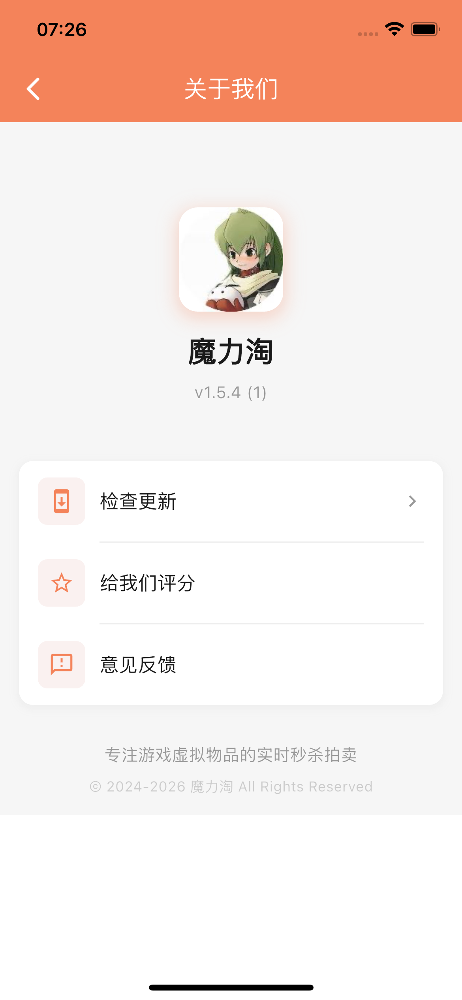

**版本号格式说明**：
- 主版本号.次版本号.修订号（如v1.0.0）
- 构建编号为递增数字
- 新版本可能包含功能更新、Bug修复、性能优化

---

## 5. 操作流程说明

本章节详细说明主要功能的完整操作流程，帮助用户快速上手使用。

### 5.1 用户注册登录流程

**流程概述**：新用户首次使用需要下载安装应用，然后选择登录方式进入平台。

**详细步骤**：

| 步骤 | 操作 | 说明 |
|------|------|------|
| 1 | 下载安装 | 从应用市场下载并安装应用 |
| 2 | 启动应用 | 点击图标启动应用 |
| 3 | 查看引导 | 首次启动可能显示引导页（可跳过） |
| 4 | 选择登录方式 | 账号密码登录或微信一键登录 |
| 5a | 账号密码登录 | 输入用户名和密码，点击登录 |
| 5b | 微信一键登录 | 点击微信图标，授权后自动登录 |
| 6 | 完成登录 | 验证成功后自动跳转首页 |
| 7 | 完善信息 | 首次登录可完善个人资料（可选） |

**注意事项**：
- 首次使用微信登录需绑定已有账号
- 连续输错密码5次账号锁定30分钟
- 建议绑定多种登录方式便于快速登录

**异常处理**：

| 情况 | 处理方式 |
|------|----------|
| 账号不存在 | 提示账号未注册，联系客服 |
| 密码错误 | 提示账号或密码错误，重新输入 |
| 网络异常 | 检查网络连接后重试 |
| 微信未安装 | 提示安装微信或使用账号登录 |

### 5.2 发布商品流程

**流程概述**：用户将闲置物品信息发布到平台，等待其他用户联系协商。

**详细步骤**：

| 步骤 | 操作 | 说明 |
|------|------|------|
| 1 | 进入发布页 | 点击首页或个人中心发布按钮 |
| 2 | 输入标题 | 填写帖子标题（最多100字，必填） |
| 3 | 选择分类 | 选择帖子分类（交易/求购等，必选） |
| 4 | 编辑内容 | 编辑帖子内容，描述物品详情 |
| 5 | 上传图片 | 选择或拍摄商品图片（最多9张） |
| 6 | 填写联系方式 | 输入微信或QQ号（可选） |
| 7 | 预览确认 | 可预览帖子效果 |
| 8 | 提交发布 | 点击发布按钮完成发布 |
| 9 | 查看帖子 | 发布成功跳转帖子详情页 |

**注意事项**：
- 标题和分类为必填项
- 图片建议上传清晰、真实的照片
- 联系方式便于对方联系，建议填写
- 发布后可在个人中心管理已发布帖子

**内容规范**：
- 标题简洁明了，突出物品特点
- 内容描述真实，不夸大宣传
- 图片清晰可见，展示物品全貌
- 价格信息可在内容中说明

### 5.3 撮合沟通流程

**流程概述**：用户浏览帖子后，通过平台内置通讯工具与发布者在线协商。

**详细步骤**：

| 步骤 | 操作 | 说明 |
|------|------|------|
| 1 | 浏览帖子 | 在交易站浏览闲置物品信息 |
| 2 | 筛选搜索 | 按分类筛选或关键词搜索 |
| 3 | 查看详情 | 点击帖子查看详细信息 |
| 4 | 查看图片 | 点击图片放大查看物品细节 |
| 5 | 查看联系方式 | 查看发布者微信/QQ（如有） |
| 6 | 联系对方 | 点击"联系对方"发起私聊 |
| 7 | 在线协商 | 通过聊天协商交易细节 |
| 8 | 达成意向 | 双方协商达成初步意向 |
| 9 | 线下成交 | 双方自行线下完成交易 |

**注意事项**：
- 平台仅提供信息展示和沟通工具
- **交易由双方自行线下完成**
- **平台不参与交易环节，不提供交易担保**
- 协商过程中请保持礼貌沟通
- 建议确认物品信息后再线下交易

**沟通技巧**：
- 先了解物品详情再发起聊天
- 明确表达购买意向和需求
- 协商时间、地点、方式等细节
- 保留聊天记录作为凭证

### 5.4 充值提现流程

**流程概述**：用户通过魔力值保证金形式参与平台活动，充值需前往 PC 端完成，提现需联系管理员处理。

**充值流程**：

| 步骤 | 操作 | 说明 |
|------|------|------|
| 1 | 进入个人中心 | 点击底部导航个人中心 |
| 2 | 点击工作台 | 点击"魔力值增加"按钮 |
| 3 | 前往 PC 端 | 使用浏览器访问 www.molitao.top |
| 4 | 完成支付 | 在 PC 端完成保证金充值支付 |
| 5 | 返回 App | 充值成功后在 App 内查看魔力值 |

**提现流程**：

| 步骤 | 操作 | 说明 |
|------|------|------|
| 1 | 进入个人中心 | 点击底部导航个人中心 |
| 2 | 点击工作台 | 点击"魔力值减少"按钮 |
| 3 | 联系管理员 | 查看管理员联系方式 |
| 4 | 提交申请 | 联系管理员老淡（QQ：383875411，微信：18845639111） |
| 5 | 等待处理 | 管理员审核后完成退款 |

**注意事项**：
- 魔力值保证金固定金额为 ¥51
- 充值需前往 PC 端（www.molitao.top）完成支付
- 提现功能正在配置中，需联系管理员处理

### 5.5 账号安全设置流程

**流程概述**：用户设置账号安全相关配置，提高账号安全性。

**修改密码流程**：

| 步骤 | 操作 | 说明 |
|------|------|------|
| 1 | 进入设置 | 从个人中心点击右上角设置按钮 |
| 2 | 点击修改密码 | 点击修改密码入口 |
| 3 | 输入当前密码 | 验证当前登录密码 |
| 4 | 输入新密码 | 输入新密码（至少6位） |
| 5 | 确认新密码 | 再次输入新密码确认 |
| 6 | 提交修改 | 点击确定完成修改 |

**绑定微信流程**：

| 步骤 | 操作 | 说明 |
|------|------|------|
| 1 | 进入账号安全 | 设置 > 账号安全 |
| 2 | 点击绑定微信 | 点击绑定微信入口 |
| 3 | 唤起微信 | 系统自动唤起微信应用 |
| 4 | 确认授权 | 在微信中确认授权绑定 |
| 5 | 返回应用 | 授权成功自动返回 |
| 6 | 绑定完成 | 显示已绑定状态 |

**注意事项**：
- 密码建议包含字母和数字
- 绑定微信后可快速登录
- 建议绑定多种登录方式
- 定期修改密码提高安全性

---

## 6. 常见问题

本章节收集用户常见问题和解答，帮助用户快速解决使用中遇到的困惑。

### 6.1 账号相关

**Q1：如何修改个人信息？**

A：进入个人中心，点击头像区域进入个人信息编辑页面，可修改头像、昵称、QQ号、微信号等信息，修改完成后点击保存按钮提交。

**Q2：忘记密码怎么办？**

A：请联系客服提供账号信息进行密码重置。为避免此情况，建议绑定微信或手机号，便于快速登录。

**Q3：如何绑定微信？**

A：进入个人中心 > 右上角设置按钮 > 账号安全，点击绑定微信，在微信中确认授权后完成绑定。

**Q4：如何更换绑定的手机号？**

A：进入个人中心 > 设置 > 账号安全，点击绑定手机号，输入新手机号并获取验证码，验证成功后完成更换。

### 6.2 功能使用

**Q5：如何联系帖子发布者？**

A：在帖子详情页点击"联系对方"按钮，系统会自动跳转到私聊界面，您可以直接发送消息与对方沟通。

**Q6：如何发布闲置物品信息？**

A：点击首页右下角发布按钮或个人中心的发布入口，填写标题、选择分类、编辑内容、上传图片，最后点击发布提交。

**Q7：如何删除已发布的帖子？**

A：进入帖子详情页（需是作者本人），点击删除按钮即可删除帖子。删除后不可恢复，请谨慎操作。

**Q8：如何添加好友？**

A：在通讯录页面使用搜索功能输入对方昵称，找到后点击添加好友按钮发送申请，对方同意后即可成为好友。

### 6.3 交易相关

**Q9：平台提供交易担保吗？**

A：本平台仅提供信息展示和沟通工具，不参与交易环节，不提供交易担保。交易由用户自行线下完成，请自行评估交易风险。

**Q10：交易产生纠纷怎么办？**

A：平台不参与交易环节，交易纠纷由用户自行协商解决。建议在交易前充分沟通，确认物品信息和交易细节。

**Q11：支付失败怎么办？**

A：请检查网络连接和支付账户余额，确保网络稳定后重新尝试支付。如问题持续，请联系客服处理。

**Q12：如何退还魔力值？**

A：提现功能正在配置中。如需退还魔力值保证金，请联系管理员老淡处理（QQ：383875411，微信：18845639111）。

### 6.4 消息通知

**Q13：如何开启消息推送？**

A：进入个人中心 > 设置 > 推送通知开关，打开开关即可接收消息推送通知。

**Q14：为什么收不到消息推送？**

A：请检查以下设置：
1. 应用内推送通知开关是否开启
2. 手机系统通知权限是否开启
3. 手机是否开启省电模式（可能限制后台推送）

### 6.5 其他问题

**Q15：如何查看历史订单？**

A：进入个人中心，在买家功能区或卖家功能区可查看对应的订单记录，包括进行中和已完成订单。

**Q16：如何清除缓存？**

A：进入个人中心 > 设置 > 清除缓存，点击清除缓存按钮可清理应用缓存数据，不影响账号信息和聊天记录。

**Q17：如何退出登录？**

A：进入个人中心 > 设置 > 退出登录，点击退出登录按钮，确认后安全退出当前账号。

**Q18：如何查看版本更新？**

A：进入个人中心 > 设置 > 关于，点击检查更新，系统会自动检测是否有新版本可用。

---

## 7. 安全说明

### 7.1 账号安全

**安全建议**：
- 设置复杂密码，建议包含字母和数字
- 定期修改登录密码
- 绑定多种登录方式（微信、手机号）
- 不要在公共设备上记住密码
- 发现账号异常及时联系客服

**账号保护**：
- 连续输错密码5次锁定30分钟
- 支持微信快捷登录，避免密码泄露
- 敏感操作需验证身份

### 7.2 交易安全

**风险提示**：
- 平台仅提供信息展示和沟通工具
- **交易由用户自行线下完成**
- **平台不参与交易环节，不提供交易担保**
- 请自行评估交易风险

**安全建议**：
- 充分了解物品信息后再决定交易
- 通过平台聊天功能保留沟通记录
- 选择安全的交易方式和地点
- 大额交易建议当面验货

### 7.3 隐私保护

**信息收集说明**：
- 用户注册信息（昵称、头像等）
- 联系方式（微信、QQ等用户自愿填写）
- 聊天记录（用于消息同步）
- 交易记录（用于账户管理）

**信息使用说明**：
- 用于平台功能正常运行
- 不会向第三方泄露用户信息
- 用户可随时修改个人信息

**隐私设置**：
- 用户可在设置中查看用户协议和隐私政策
- 用户可清除缓存数据
- 用户可删除账号信息

---

## 8. 技术支持

### 8.1 联系方式

如在使用过程中遇到问题，可通过以下方式获取帮助：

**客服支持**：
- 在线客服：应用内联系客服功能
- 工作时间：工作日 9:00-18:00

**反馈渠道**：
- 应用内意见反馈功能
- 官方网站客服入口

### 8.2 服务说明

**服务范围**：
- 账号问题咨询和解决
- 功能使用指导和帮助
- 支付问题处理
- 意见建议收集

**响应时间**：
- 在线客服实时响应
- 问题反馈1-3工作日处理

### 8.3 更新说明

**版本更新内容**：
- 功能优化和新增
- Bug修复和改进
- 性能优化提升
- 安全补丁更新

**更新方式**：
- Android：应用市场更新或官网下载
- iOS：App Store更新

---

## 附录

### A. 术语说明

| 术语 | 说明 |
|------|------|
| 帖子 | 用户发布的物品信息帖 |
| 交易站 | 帖子列表浏览页面 |
| 秒杀场 | 限时特惠活动专区 |
| 撮合 | 信息展示和沟通服务 |
| 工作台 | 账户资产管理页面 |
| 余额 | 平台虚拟货币 |

### B. 快捷操作

| 操作 | 快捷方式 |
|------|----------|
| 发布帖子 | 首页右下角悬浮按钮 |
| 发起私聊 | 帖子详情页"联系对方"按钮 |
| 充值提现 | 个人中心 > 工作台 |
| 修改信息 | 个人中心 > 点击头像 |

### C. 版本信息

- **文档版本**：V1.0
- **编写日期**：2026年5月
- **适用版本**：魔力淘App V1.0.0

---

**著作权人**：黑龙江省魔淡网络科技有限公司
