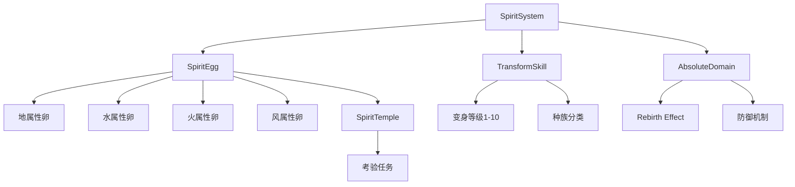

# 精灵变身系统索引

## 系统概述

精灵变身是魔力宝贝4.0版本《乐园之卵》引入的核心系统，通过装备"精灵之卵"道具消耗"爆发值"实现角色能力强化。精灵神殿有四大属性分支：地、水、火、风。

## 核心节点

### SpiritEgg（精灵之卵）

**属性分类：**
- [[spirit-eggs#地属性精灵卵]]
- [[spirit-eggs#水属性精灵卵]]
- [[spirit-eggs#火属性精灵卵]]
- [[spirit-eggs#风属性精灵卵]]

**等级系统：**
- Level 1-6（目前开放至Level 3）
- 等级提升需通过精灵神殿考验任务
- 高等级卵消耗更多爆发值但效果更强

**获取方式：**
- 精灵神殿（艾尔莎岛→神圣都市）
- 通过陨石传送至法兰城废墟
- 出城东南方向过桥到达

**装备规则：**
- 占用水晶装备位置
- 不能与水晶同时装备
- 战斗中显示"精灵变身"选项

### TransformSkill（变身技能）

**技能数据：** [[spirit-skills]]

**等级对应种族：**
| 等级 | 可变身种族 |
|------|------------|
| Lv1 | 人形系 |
| Lv2 | 野兽系 |
| Lv3 | 不死系 |
| Lv4 | 飞行系 |
| Lv5 | 昆虫系 |
| Lv6 | 植物系 |
| Lv7 | 特殊系 |
| Lv8 | 金属系 |
| Lv9 | 型系 |
| Lv10 | 邪魔系 |

### AbsoluteDomain（绝对领域）

**机制详解：** [[absolute-domain]]

**核心特性：**
- 变身当回合发动"Rebirth Effect"结界
- 一回合内抵挡所有物理和魔法攻击
- 类似"绝对领域"防御机制
- 装备耐久度仍会减少

## 关系定义



## 数据文件

- [[spirit-cards]] - 精灵之卵卡片详细数据
- [[absolute-domain]] - 绝对领域机制说明
- [[spirit-skills]] - 变身技能等级与种族对应表

## 使用场景

**战斗系：**
- 攻击力UP
- 耐久力UP
- 魔法效果UP
- 属性效果UP

**生产系：**
- 提升制作物品能力
- 可制作等级1以上道具
- 提高回复量

**采集系：**
- 每次采集消耗1分钟卡时
- 提升采集品质

## 限制与消耗

**爆发值消耗：**
- 低等级→低消费、低Power
- 高等级→高消费、高Power
- 类似打卡时间持续消耗

**变身解除条件：**
- 变身后第二回合未受攻击自动解除
- 主动点击选项解除
- 登出后效果消失

## 下游应用

- 变身卡片收集系统
- 战斗策略规划（属性克制计算）
- 生产系优化方案
- 精灵神殿任务攻略

## 相关任务

- [[仙人就职任务]] - 变身技能学习前置
- [[精灵神殿考验任务]] - 精灵之卵获取
- [[家族系统]] - 3级以上精灵卵升级（关联）

## 元数据

```yaml
tags: [精灵变身, 系统机制, 4.0版本]
created: 2026-05-06
updated: 2026-05-06
version: 4.0
source: 魔力宝贝官方资料站
```